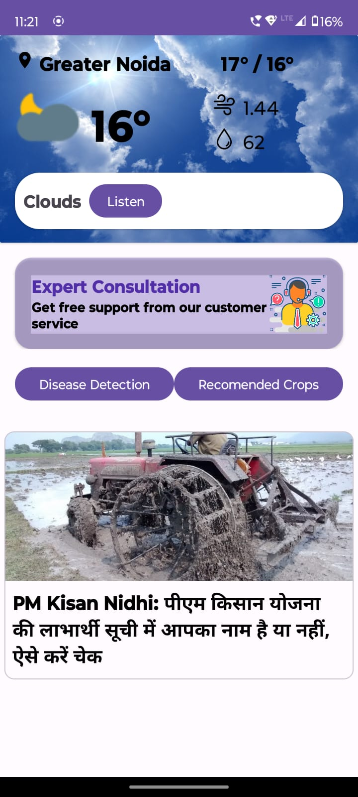
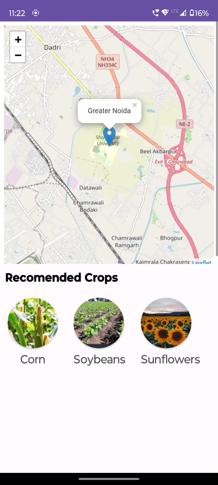
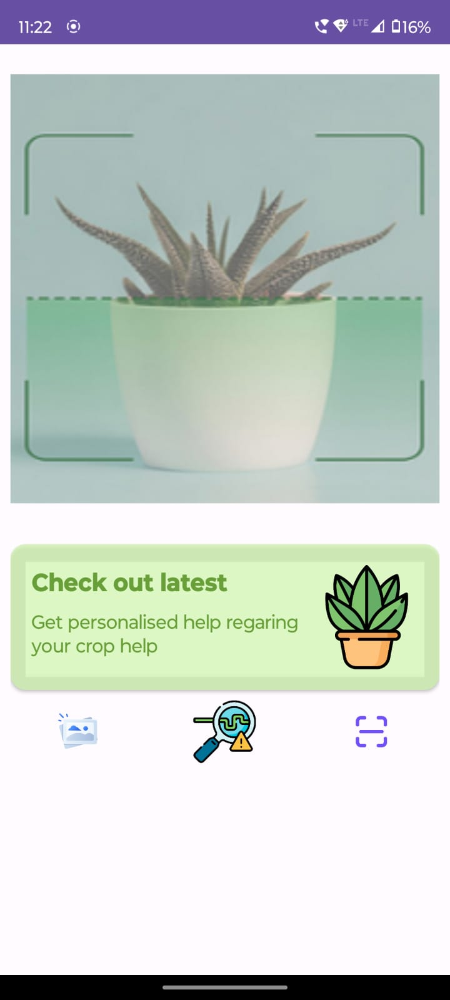

# HiKisan

Revolutionizing Agriculture with AI Disease Detection and Voice Assistance

Embark on a transformative journey with HiKisan India, where innovation meets agriculture for exceptional results. Beyond traditional practices, we introduce a game-changing feature – AI-powered disease detection.

## AI Disease Detection:

Leaf Photo Analysis: Capture a photo of your crop's leaves; our AI swiftly detects and reports diseases or abnormalities.

Precise Results: Timely reports detail specific diseases, enabling quick action for harvest protection and yield optimization.

Enhanced Health Monitoring: HiKisan India's AI proactively monitors crop health, addressing potential issues before escalation.

## Voice Assistant:

Seamless Commands: Farmers can effortlessly command tasks within the app using our voice assistant for a hands-free and efficient experience.

## Multilingual Accessibility:

More than technology, HiKisan India is about accessibility. Currently in Hindi and Marathi, we're expanding language support for farmers across diverse backgrounds. Join us in r

evolutionizing agriculture for a prosperous future!

## App screen-shots

